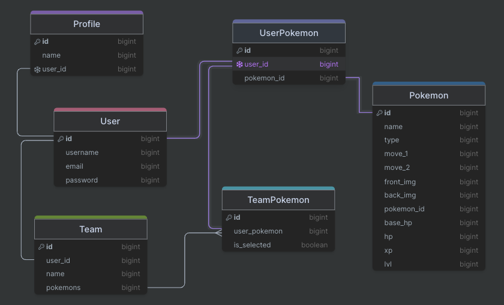
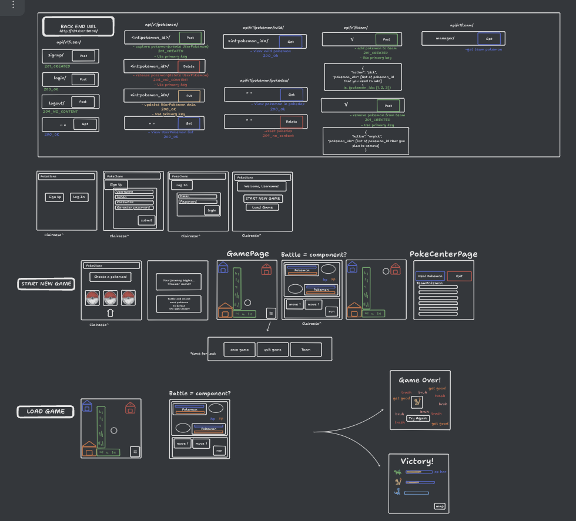

# PokeClone

This project is a game made from a React front-end framework and Django back-end. Although it is based off the Pokemon game, this is not deployed and is not for profit or monetary gain. This project served as an educational group project as this was all our first times collaborating to see how far we could get trying to create a game with our combined skills.

Users can signup, login and start their PokeClone journey.  Pick a starter Pokemon to be added to your PokeTeam to help you capture more pokemon and train them enough to beat the Gym leader! Go to the PokeCenter to heal your pokemon back to full health.  Users can go to their house and choose up to a team of 6 pokemon from their captured pokemon. Open the pokedex to view stats of all the pokemon the user has encountered

## Authors

- [@ClaireinCode](https://github.com/ClaireinCode)
- [@phubui1996](https://github.com/phubui1996)
- [@Jkim1122](https://github.com/Jkim1122)

## Features

- User Authentication
- Images from pokeapi.co
- User pokeTeam CRUD capability

## Screenshots

